# Tikòb Ops Log — January 2026

## Timeline
- 2026-01-10: Completed design review for ledger event sourcing and double-entry invariants.
- 2026-01-20: Deployed Plaid adapter staging with end-to-end webhook replay for bank feeds.
- 2026-01-30: Began S.A.S. Logic compiler integration work to produce deterministic interest computations.

## Current Phase
We are in a focused Engineering phase: "Ledger Precision & Compiler Integration." Work is concentrated on hardening the double-entry event sourcing model, validating deterministic time-weighted interest allocation, and integrating the S.A.S. Logic compiler to produce reproducible financial projections and tax buckets.

## Technical Notes
This update formalizes the operational and architectural changes necessary to integrate a compiler-driven computation layer (S.A.S. Logic) into TiKòb's financial pipeline. S.A.S. Logic compiles high-level financial policies (interest rules, tax allocation rules) into deterministic kernels that can be executed inside the ledger reconciliation and background job processes.

Rationale and key design points (derived from README):
- Ledger as canonical source of truth: All financial actions are persisted as immutable LedgerEvent objects; LedgerPosting records are always balanced.
- Determinism: All monetary math uses fixed-decimal arithmetic with ROUND_HALF_EVEN to preserve accounting correctness across replays.
- Compiler integration (S.A.S. Logic): The compiler will accept policy DSL (.sas files), emit verified IR for time-weighted interest and tax allocation, and enable deterministic, replayable job runs for audits.
- Isolation and security: Compiler-generated kernels run in sandboxed worker processes; inputs are validated and limited to avoid leaking PII to AI services.

Operational changes:
- Background job workers now include a compiler step that validates .sas artifacts before execution.
- Reconciliation workflows will tag events produced by compiler runs to help tracing and audit exports.
- Tax reporting pipeline (TaxBucket → TaxReport) will consume compiler outputs as the authoritative rule set for 1099-style generation.

## TensorFlow-Style Computational Graph (Conceptual)
(This is NOT executable code. It is a conceptual diagram for human readers.)

RawContribution
    ↓
[Auth & Normalize]
    ↓
[Preprocess (Decimal Normalize)]
    ↓
[S.A.S. Compiler -> CompiledKernel]
    ↓
[ComputeInterestKernel]
    ├── BalancedPostingFlow → [LedgerEvent Creator] → [LedgerPosting] → [Projection]
    └── TaxAllocationFlow → [TaxBucket Updater] → [TaxReport Generator]
    ↓
[Audit & Export]

## Visual Diagram (Mermaid, Colorful)

```mermaid
flowchart LR
  RC["Raw Contribution"]
  AN["Auth & Normalize"]
  PRE["Preprocess\n(decimal normalize)"]
  SASC["S.A.S. Compiler\n(.sas -> CompiledKernel)"]
  CK["Compiled Kernel\n(ComputeInterestKernel)"]
  BP["Balanced Posting Flow"]
  TA["Tax Allocation Flow"]
  LE["LedgerEvent Creator"]
  LP["LedgerPosting"]
  PJ["Projection / Balances"]
  TB["TaxBucket Updater"]
  TR["TaxReport Generator"]
  AE["Audit & Export"]

  RC --> AN --> PRE --> SASC --> CK
  CK --> BP --> LE --> LP --> PJ --> AE
  CK --> TA --> TB --> TR --> AE

  classDef core fill:#f7e6ff,stroke:#8a2be2,stroke-width:2px,color:#4b0082;
  classDef compiler fill:#fff4e6,stroke:#f9ab00,stroke-width:2px,color:#663300;
  classDef ledger fill:#e6fff2,stroke:#009966,stroke-width:2px,color:#004d33;
  classDef audit fill:#ffe6f0,stroke:#ff66a3,stroke-width:2px,color:#660033;

  class RC,AN,PRE,CK core;
  class SASC compiler;
  class BP,LE,LP,PJ,TB,TR ledger;
  class AE audit;
```
